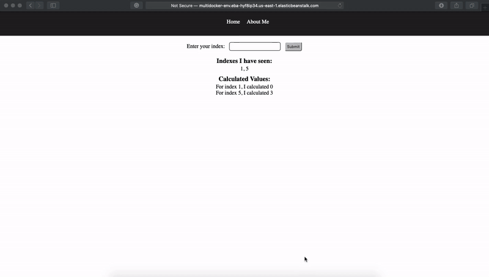

# docker-multicontainer-complex-fibonacci-app

> How to publish docker multicontainer complex fibonacci app on AWSEB (Which uses Node.js, express.js, react, nginx, redis and postgres).

Live on: http://multidocker-env.eba-hyf8ip34.us-east-1.elasticbeanstalk.com

> The Site might be down now, Because AWS charges money and I cannot afford it on daily basis(I am student). Wanna buy a coffee for me? visit here https://www.patreon.com/xscotophilic

### Don't forget to check /client/nginx/default.conf
